## Architecture Overview

Citizen is designed as a modern, microservices-based platform that provides a comprehensive web interface for application infrastructure management. The architecture emphasizes security, scalability, and developer experience.

<Frame>

</Frame>

## Core Components

The platform consists of several key components that work together to provide a seamless infrastructure management experience.

### Frontend Layer

<Tabs>
<Tab title="Preact Application">
**Technology Stack:**
- **Preact 10** - Lightweight React alternative (3KB runtime)
- **TypeScript 5** - Type-safe development with modern JavaScript features
- **Vite** - Lightning-fast build tool with Hot Module Replacement
- **Tailwind CSS** - Utility-first CSS framework for rapid UI development
- **Wouter** - Minimalist client-side routing (1.3KB)

**Key Features:**
- Component-based architecture with reusable UI elements
- Real-time data updates using WebSocket connections
- Progressive Web App (PWA) capabilities
- Responsive design optimized for desktop and mobile
- Dark/light theme support with system preference detection
</Tab>

<Tab title="Build System">
**Vite Configuration:**
```javascript
export default defineConfig({
  plugins: [preact()],
  build: {
    target: 'es2020',
    minify: 'esbuild',
    sourcemap: true,
    rollupOptions: {
      output: {
        manualChunks: {
          vendor: ['preact', 'preact/hooks'],
          router: ['wouter']
        }
      }
    }
  },
  server: {
    port: 3000,
    host: true,
    proxy: {
      '/api': 'http://backend:3000'
    }
  }
})
```

**Performance Optimizations:**
- Code splitting with dynamic imports
- Tree shaking for minimal bundle size
- Asset optimization and compression
- Service worker for offline capabilities
</Tab>

<Tab title="State Management">
**Context-based State:**
```typescript
interface AppState {
  user: User | null;
  apps: Application[];
  deployments: Deployment[];
  notifications: Notification[];
}

const AppContext = createContext<AppState>();

// Custom hooks for state management
export const useAuth = () => useContext(AuthContext);
export const useApps = () => useContext(AppsContext);
export const useNotifications = () => useContext(NotificationContext);
```

**Features:**
- Centralized authentication state
- Real-time application status updates
- Persistent user preferences
- Optimistic UI updates
</Tab>
</Tabs>

### Backend API Layer

<Tabs>
<Tab title="Go Fiber Framework">
**Technology Stack:**
- **Go 1.23+** - High-performance, compiled language
- **Fiber v2** - Express-inspired web framework for Go
- **GORM** - Feature-rich ORM with auto-migrations
- **JWT-Go** - JSON Web Token implementation
- **Validator** - Struct and field validation

**API Architecture:**
```go
// Main application structure
type App struct {
    Router *fiber.App
    DB     *gorm.DB
    Redis  *redis.Client
    Config *Config
}

// Handler structure
type Handlers struct {
    Auth   *AuthHandler
    Dokku  *DokkuHandler
    GitHub *GitHubHandler
    Docker *DockerHandler
}

// Middleware stack
app.Use(cors.New())
app.Use(helmet.New())
app.Use(csrf.New())
app.Use(logger.New())
app.Use(auth.JWTMiddleware())
```
</Tab>

<Tab title="Database Layer">
**PostgreSQL 16 with GORM:**
```go
// User model with audit fields
type User struct {
    ID        uint      `gorm:"primaryKey"`
    Username  string    `gorm:"uniqueIndex;not null"`
    Email     string    `gorm:"uniqueIndex;not null"`
    Password  string    `gorm:"not null"`
    Role      string    `gorm:"default:user"`
    CreatedAt time.Time
    UpdatedAt time.Time
    DeletedAt gorm.DeletedAt `gorm:"index"`
}

// Application model with JSONB metadata
type Application struct {
    ID          uint           `gorm:"primaryKey"`
    Name        string         `gorm:"uniqueIndex;not null"`
    Domain      string         `gorm:"index"`
    GitURL      string
    Status      string         `gorm:"default:inactive"`
    Config      datatypes.JSON `gorm:"type:jsonb"`
    UserID      uint
    User        User
    Deployments []Deployment
    CreatedAt   time.Time
    UpdatedAt   time.Time
}
```

**Advanced Features:**
- JSONB fields for flexible metadata storage
- Soft deletes with audit trails
- Database migrations with version control
- Connection pooling and query optimization
- Full-text search capabilities
</Tab>

<Tab title="Caching Layer">
**Redis 7 Integration:**
```go
// Session management
type SessionManager struct {
    redis *redis.Client
    ttl   time.Duration
}

func (s *SessionManager) Set(sessionID string, data interface{}) error {
    json, _ := json.Marshal(data)
    return s.redis.Set(context.Background(), sessionID, json, s.ttl).Err()
}

// Application cache
type AppCache struct {
    redis *redis.Client
}

func (c *AppCache) CacheAppStatus(appID string, status AppStatus) {
    key := fmt.Sprintf("app:status:%s", appID)
    c.redis.HSet(context.Background(), key, map[string]interface{}{
        "status":     status.Status,
        "health":     status.Health,
        "updated_at": time.Now().Unix(),
    })
    c.redis.Expire(context.Background(), key, 5*time.Minute)
}
```

**Cache Strategies:**
- Session storage with automatic expiration
- Application status caching
- API response caching
- Rate limiting with sliding windows
</Tab>
</Tabs>

### Infrastructure Layer

<Tabs>
<Tab title="Traefik Reverse Proxy">
**Configuration:**
```yaml
# traefik.yml
api:
  dashboard: true
  insecure: false

entryPoints:
  web:
    address: ":80"
    http:
      redirections:
        entrypoint:
          to: websecure
          scheme: https
  websecure:
    address: ":443"

certificatesResolvers:
  letsencrypt:
    acme:
      email: admin@yourdomain.com
      storage: /data/acme.json
      httpChallenge:
        entryPoint: web

providers:
  docker:
    exposedByDefault: false
  file:
    filename: /config/dynamic_conf.yml
    watch: true
```

**Dynamic Routing:**
- Automatic service discovery via Docker labels
- SSL termination with Let's Encrypt
- Load balancing and health checks
- Request/response middleware
- Real-time configuration updates
</Tab>

<Tab title="Docker Containerization">
**Multi-stage Build Example:**
```dockerfile
# Backend Dockerfile
FROM golang:1.23-alpine AS builder

WORKDIR /app
COPY go.mod go.sum ./
RUN go mod download

COPY . .
RUN CGO_ENABLED=0 GOOS=linux go build \
    -ldflags="-w -s" \
    -o main ./cmd/server

FROM gcr.io/distroless/static-debian12
COPY --from=builder /app/main /
EXPOSE 3000
USER nonroot:nonroot
ENTRYPOINT ["/main"]
```

**Security Features:**
- Distroless base images
- Non-root user execution
- Read-only filesystems
- Capability dropping
- Resource limits and quotas
</Tab>

<Tab title="Dokku Integration">
**SSH-based Communication:**
```go
type DokkuClient struct {
    host       string
    user       string
    privateKey string
    timeout    time.Duration
}

func (d *DokkuClient) ExecuteCommand(cmd string) (*CommandResult, error) {
    config := &ssh.ClientConfig{
        User: d.user,
        Auth: []ssh.AuthMethod{
            ssh.PublicKeys(d.signer),
        },
        HostKeyCallback: ssh.InsecureIgnoreHostKey(),
        Timeout:         d.timeout,
    }
    
    client, err := ssh.Dial("tcp", d.host+":22", config)
    if err != nil {
        return nil, err
    }
    defer client.Close()
    
    session, err := client.NewSession()
    if err != nil {
        return nil, err
    }
    defer session.Close()
    
    output, err := session.CombinedOutput(cmd)
    return &CommandResult{
        Output:   string(output),
        ExitCode: session.ExitStatus(),
        Error:    err,
    }, nil
}
```

**Dokku Commands:**
- Application lifecycle management
- Domain and SSL certificate management
- Environment variable configuration
- Database and service management
- Log streaming and monitoring
</Tab>
</Tabs>

## Data Flow Patterns

Understanding how data flows through the system is crucial for debugging and optimization.

### Authentication Flow

<Steps>
<Step title="User Login">

</Step>

<Step title="Authenticated Requests">

</Step>

<Step title="Session Management">
- JWT tokens with 24-hour expiration
- Refresh token rotation for security
- Session invalidation on logout
- Cross-domain session sharing
- Rate limiting per user session
</Step>
</Steps>

### Application Deployment Flow

```mermaid
graph TB
    A[User Initiates Deploy] --> B[Frontend Sends Request]
    B --> C[API Validates Request]
    C --> D[SSH to Dokku Server]
    D --> E[Execute Git Deploy]
    E --> F[Stream Build Logs]
    F --> G[Update App Status]
    G --> H[Notify Frontend]
    H --> I[Real-time UI Update]
```

<Steps>
<Step title="Git-based Deployment">

</Step>

<Step title="Docker Image Deployment">

</Step>

<Step title="Status Monitoring">
- Real-time deployment progress tracking
- Build log streaming via WebSocket
- Health check monitoring
- Automatic rollback on failure
- Deployment history and versioning
</Step>
</Steps>

### Real-time Communication

<Tabs>
<Tab title="WebSocket Implementation">
```go
// WebSocket manager
type WSManager struct {
    clients    map[string]*WSClient
    register   chan *WSClient
    unregister chan *WSClient
    broadcast  chan []byte
    mutex      sync.RWMutex
}

// Client connection
type WSClient struct {
    conn   *websocket.Conn
    userID string
    appID  string
    send   chan []byte
}

// Broadcast deployment updates
func (m *WSManager) BroadcastDeploymentUpdate(appID string, update DeploymentUpdate) {
    message, _ := json.Marshal(update)
    
    m.mutex.RLock()
    for _, client := range m.clients {
        if client.appID == appID {
            select {
            case client.send <- message:
            default:
                m.unregisterClient(client)
            }
        }
    }
    m.mutex.RUnlock()
}
```
</Tab>

<Tab title="Event Types">
**Deployment Events:**
- `deployment.started` - Deployment initiated
- `deployment.building` - Build process running
- `deployment.deploying` - Container deployment
- `deployment.completed` - Successful deployment
- `deployment.failed` - Deployment failure

**Application Events:**
- `app.status.changed` - Status update
- `app.health.changed` - Health check result
- `app.scaled` - Instance scaling
- `app.restarted` - Application restart

**System Events:**
- `system.maintenance` - Maintenance mode
- `system.alert` - Critical alerts
- `user.session.expired` - Session expiration
</Tab>

<Tab title="Frontend Integration">
```typescript
class WSConnection {
  private ws: WebSocket | null = null;
  private reconnectAttempts = 0;
  private maxReconnectAttempts = 5;

  connect(token: string) {
    const wsUrl = `wss://${window.location.host}/api/v1/ws?token=${token}`;
    this.ws = new WebSocket(wsUrl);

    this.ws.onopen = () => {
      console.log('WebSocket connected');
      this.reconnectAttempts = 0;
    };

    this.ws.onmessage = (event) => {
      const data = JSON.parse(event.data);
      this.handleMessage(data);
    };

    this.ws.onclose = () => {
      this.attemptReconnect();
    };
  }

  private handleMessage(data: WSMessage) {
    switch (data.type) {
      case 'deployment.update':
        store.dispatch(updateDeployment(data.payload));
        break;
      case 'app.status':
        store.dispatch(updateAppStatus(data.payload));
        break;
    }
  }
}
```
</Tab>
</Tabs>

## Security Architecture

Citizen implements defense-in-depth security with multiple layers of protection.

### Application Security

<Tabs>
<Tab title="Authentication & Authorization">
**JWT Implementation:**
```go
type Claims struct {
    UserID   uint   `json:"user_id"`
    Username string `json:"username"`
    Role     string `json:"role"`
    jwt.RegisteredClaims
}

func GenerateToken(user User) (string, error) {
    claims := &Claims{
        UserID:   user.ID,
        Username: user.Username,
        Role:     user.Role,
        RegisteredClaims: jwt.RegisteredClaims{
            ExpiresAt: jwt.NewNumericDate(time.Now().Add(24 * time.Hour)),
            IssuedAt:  jwt.NewNumericDate(time.Now()),
            NotBefore: jwt.NewNumericDate(time.Now()),
            Issuer:    "citizen",
        },
    }
    
    token := jwt.NewWithClaims(jwt.SigningMethodHS256, claims)
    return token.SignedString([]byte(config.JWTSecret))
}
```

**Role-based Access Control:**
- Admin: Full system access
- Developer: Application management
- Viewer: Read-only access
- Custom roles with granular permissions
</Tab>

<Tab title="Input Validation">
**Request Validation:**
```go
type CreateAppRequest struct {
    Name        string `json:"name" validate:"required,min=3,max=50,alphanum"`
    Repository  string `json:"repository" validate:"required,url"`
    Branch      string `json:"branch" validate:"required,min=1,max=100"`
    Environment map[string]string `json:"environment" validate:"dive,keys,required,endkeys,required"`
}

// Middleware validation
func ValidateRequest[T any](c *fiber.Ctx) error {
    var req T
    if err := c.BodyParser(&req); err != nil {
        return c.Status(400).JSON(fiber.Map{
            "error": "Invalid request format",
        })
    }
    
    if err := validator.Validate(req); err != nil {
        return c.Status(400).JSON(fiber.Map{
            "error": "Validation failed",
            "details": err.Error(),
        })
    }
    
    c.Locals("request", req)
    return c.Next()
}
```

**Security Features:**
- SQL injection prevention with parameterized queries
- XSS protection with input sanitization
- CSRF token validation
- Rate limiting and DDoS protection
- Content Security Policy headers
</Tab>

<Tab title="Container Security">
**Dockerfile Security:**
```dockerfile
# Use distroless base image
FROM gcr.io/distroless/static-debian12

# Copy only necessary files
COPY --from=builder --chown=nonroot:nonroot /app/main /

# Use non-root user
USER nonroot:nonroot

# Read-only filesystem
VOLUME ["/tmp"]

# Minimal attack surface
ENTRYPOINT ["/main"]
```

**Security Enhancements:**
- Minimal base images (distroless)
- Non-root user execution
- Read-only root filesystem
- Capability dropping
- Security scanning in CI/CD
- Regular security updates
</Tab>
</Tabs>

### Network Security

<Steps>
<Step title="TLS Termination">
Traefik handles SSL/TLS termination with modern cipher suites and security headers.

```yaml
# Security headers middleware
securityHeaders:
  headers:
    accessControlAllowMethods:
      - GET
      - OPTIONS
      - PUT
      - POST
      - DELETE
    accessControlMaxAge: 100
    hostsProxyHeaders:
      - "X-Forwarded-Host"
    referrerPolicy: "same-origin"
    customRequestHeaders:
      X-Forwarded-Proto: "https"
    customResponseHeaders:
      X-Robots-Tag: "none,noarchive,nosnippet,notranslate,noimageindex"
      X-Forwarded-Proto: "https"
    sslRedirect: true
    stsIncludeSubdomains: true
    stsPreload: true
    stsSeconds: 31536000
    forceSTSHeader: true
    frameDeny: true
    contentTypeNosniff: true
    browserXssFilter: true
```
</Step>

<Step title="Firewall Configuration">
Network-level protection with properly configured firewall rules.

```bash
# UFW firewall rules
sudo ufw default deny incoming
sudo ufw default allow outgoing
sudo ufw allow ssh
sudo ufw allow 80/tcp
sudo ufw allow 443/tcp

# Application-specific rules
sudo ufw allow from 10.0.0.0/8 to any port 5432  # PostgreSQL
sudo ufw allow from 10.0.0.0/8 to any port 6379  # Redis
```
</Step>

<Step title="Internal Communication">
Services communicate over isolated Docker networks with service discovery.

```yaml
# Docker Compose network configuration
networks:
  citizen-internal:
    driver: bridge
    internal: true
  citizen-external:
    driver: bridge

services:
  backend:
    networks:
      - citizen-internal
      - citizen-external
  
  postgres:
    networks:
      - citizen-internal
  
  redis:
    networks:
      - citizen-internal
```
</Step>
</Steps>

## Performance Characteristics

Citizen is optimized for high performance and efficient resource utilization.

### Benchmarks

<Tabs>
<Tab title="API Performance">
**Response Times (95th percentile):**
- Authentication: < 50ms
- Application list: < 100ms
- Deployment creation: < 200ms
- Health checks: < 25ms
- WebSocket connection: < 10ms

**Throughput:**
- 1000+ requests/second on modest hardware
- Concurrent WebSocket connections: 10,000+
- Database queries: < 5ms average
</Tab>

<Tab title="Resource Usage">
**Memory Consumption:**
- Backend API: 50-100MB
- Frontend (served): 10-20MB
- PostgreSQL: 100-200MB
- Redis: 20-50MB
- Traefik: 30-50MB

**CPU Usage:**
- Idle system: < 5% CPU
- Under load: 20-40% CPU
- During deployments: 40-60% CPU
</Tab>

<Tab title="Scaling Characteristics">
**Horizontal Scaling:**
- Stateless backend services
- Database connection pooling
- Session storage in Redis
- Load balancing via Traefik

**Vertical Scaling:**
- Optimized for single-server deployments
- Efficient resource utilization
- Automatic garbage collection tuning
- Memory-mapped file usage
</Tab>
</Tabs>

## Monitoring and Observability

Comprehensive monitoring ensures system reliability and performance.

### Health Endpoints

<ParamField path="/health" method="GET">
Basic health status of all components
</ParamField>

<ParamField path="/health/detailed" method="GET">
Comprehensive system metrics and component status
</ParamField>

<ParamField path="/health/ready" method="GET">
Kubernetes-style readiness probe for load balancers
</ParamField>

<ParamField path="/health/live" method="GET">
Kubernetes-style liveness probe for monitoring systems
</ParamField>

### Metrics Collection

<CodeGroup>
```go Prometheus Metrics
var (
    httpRequestsTotal = prometheus.NewCounterVec(
        prometheus.CounterOpts{
            Name: "http_requests_total",
            Help: "Total number of HTTP requests",
        },
        []string{"method", "endpoint", "status"},
    )
    
    httpDuration = prometheus.NewHistogramVec(
        prometheus.HistogramOpts{
            Name: "http_request_duration_seconds",
            Help: "HTTP request duration in seconds",
        },
        []string{"method", "endpoint"},
    )
    
    activeConnections = prometheus.NewGauge(
        prometheus.GaugeOpts{
            Name: "websocket_connections_active",
            Help: "Number of active WebSocket connections",
        },
    )
)
```

```yaml Grafana Dashboard
apiVersion: 1
datasources:
  - name: Prometheus
    type: prometheus
    url: http://prometheus:9090

dashboards:
  - title: "Citizen Overview"
    panels:
      - title: "Request Rate"
        type: "graph"
        targets:
          - expr: "rate(http_requests_total[5m])"
      
      - title: "Response Time"
        type: "graph"
        targets:
          - expr: "histogram_quantile(0.95, http_request_duration_seconds_bucket)"
      
      - title: "Active Connections"
        type: "stat"
        targets:
          - expr: "websocket_connections_active"
```
</CodeGroup>

<Note>
**Architecture Benefits**: This architecture provides excellent scalability, security, and maintainability while keeping operational complexity low. The microservices approach allows for independent scaling and updates of components as needed.
</Note>